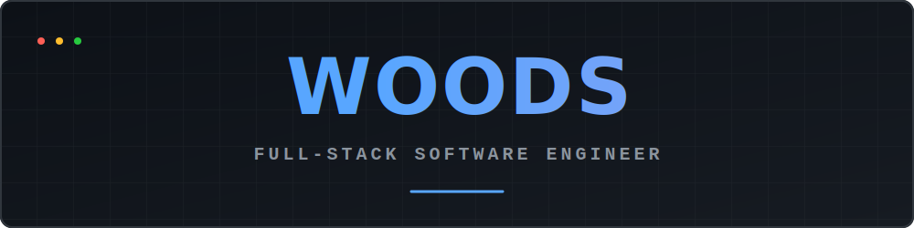

<!-- Premium Typographic Header -->
<div align="center">
  
</div>

<!-- Animated Greeting & Role -->
<p align="center">
  
</p>

<!-- Social Shields -->
<p align="center">
  <a href="https://github.com/nimalekyt-bit"></a>
  <a href="https://t.me/woodskilla"></a>
  <a href="mailto:nikitanimalkov@gmail.com"></a>
</p>

<br/>

### 💻 `system.info()`

```javascript
/**
 * @class Developer
 * @name Woods
 * @role Full-Stack Software Engineer
 */
class Woods extends Developer {
  constructor() {
    super();
    this.status = "Building exceptional digital experiences";
    this.techStack = {
      frontend: ["React", "Next.js", "TailwindCSS"],
      backend: ["Python", "FastAPI", "Node.js"],
      database: ["PostgreSQL", "MySQL", "MongoDB"],
      devops: ["Docker", "GitHub Actions", "Vercel"]
    };
    this.currentFocus = "Architecting scalable cloud solutions & Web3";
    this.contact = {
      email: "nikitanimalkov@gmail.com",
      telegram: "@woodskilla"
    };
  }

  execute() {
    return this.techStack.frontend.concat(this.techStack.backend).join(" ⚡ ");
  }
}
```

<br/>

<div align="center">
  
</div>

<p align="center">
  
</p>

<br/>

<div align="center">
  
</div>

<p align="center">
  
  
</p>

<p align="center">
  
</p>

<br/>

<div align="center">
  
</div>

<p align="center">
  <a href="https://github.com/nimalekyt-bit/visitka-site">
    
  </a>
  <a href="https://github.com/nimalekyt-bit/assetforge">
    
  </a>
</p>
<p align="center">
  <a href="https://github.com/nimalekyt-bit/dijkstra-visualizer">
    
  </a>
</p>

<br/>

<div align="center">
  
</div>

<p align="center">
  <picture>
    <source media="(prefers-color-scheme: dark)" srcset="https://raw.githubusercontent.com/nimalekyt-bit/nimalekyt-bit/output/github-contribution-grid-snake-dark.svg">
    <source media="(prefers-color-scheme: light)" srcset="https://raw.githubusercontent.com/nimalekyt-bit/nimalekyt-bit/output/github-contribution-grid-snake.svg">
    
  </picture>
</p>

<p align="center">
  
</p>
