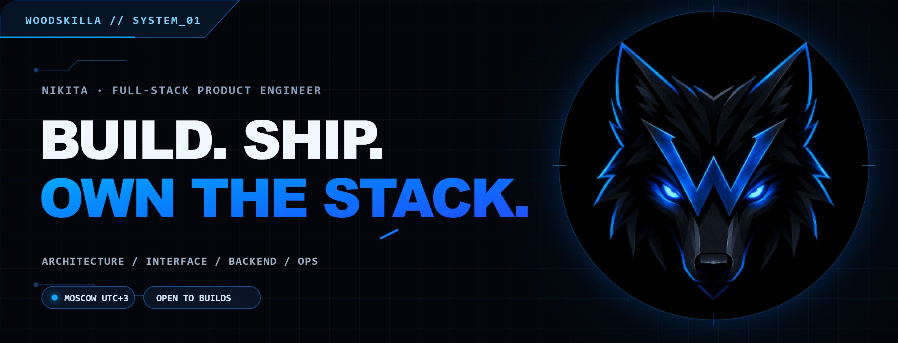

  

    

  <strong>I build production systems from the first architecture sketch to deployment and support.</strong>

    

  <a href="https://t.me/woodskilla"><strong>Telegram ↗</strong></a>
  &nbsp;&nbsp;·&nbsp;&nbsp;
  <a href="mailto:nikitanimalkov@gmail.com"><strong>Email ↗</strong></a>

 

I’m Nikita, a full-stack developer working under the name **woodskilla**. I take ownership of the interface, backend, data model and release pipeline, so a product moves through one coherent technical system.

My strongest stack is **Next.js + TypeScript** on the frontend and **Python + FastAPI** on the backend. I work with PostgreSQL, Redis, Docker and GitHub Actions when the product needs them.

 

## Selected builds

<table>
  <tr>
    <td width="33.33%" valign="top">
      <h3>01 / AssetForge</h3>
      
A local-first image pipeline for background removal, smart crop and multi-format export.

      
I built the processing core, Web UI, CLI, desktop wrapper and SaaS layer.

      
<code>Python</code> <code>FastAPI</code> <code>ONNX</code> <code>Docker</code>

      <a href="https://github.com/nimalekyt-bit/assetforge"><strong>View repository →</strong></a>
    </td>
    <td width="33.33%" valign="top">
      <h3>02 / GraphLab</h3>
      
An interactive workspace for Dijkstra, Bellman–Ford and Floyd–Warshall algorithms.

      
Includes timeline controls, graph persistence, performance tests and PDF export.

      
<code>JavaScript</code> <code>Cytoscape.js</code> <code>Chart.js</code>

      <a href="https://github.com/nimalekyt-bit/dijkstra-visualizer"><strong>View repository →</strong></a>
    </td>
    <td width="33.33%" valign="top">
      <h3>03 / Portfolio System</h3>
      
A responsive portfolio with art-directed motion and an integrated content studio.

      
Editors manage projects and copy through Sanity without changing the codebase.

      
<code>Next.js</code> <code>TypeScript</code> <code>Sanity</code>

      <a href="https://github.com/nimalekyt-bit/visitka-site"><strong>View repository →</strong></a>
    </td>
  </tr>
</table>

 

## What I own

| Product engineering | Backend and data |
| :--- | :--- |
| I turn a loose brief into a clear scope, then build the interface around real user flows. | I design APIs, data models, authentication, payments and admin tools. |

| Delivery | Production support |
| :--- | :--- |
| I set up containers, CI/CD, releases and monitoring as part of the build. | I stay with the system after launch and handle fixes, maintenance and the next release. |

 

## Core stack

  <code>TypeScript</code>&nbsp;
  <code>Next.js</code>&nbsp;
  <code>React</code>&nbsp;
  <code>Python</code>&nbsp;
  <code>FastAPI</code>&nbsp;
  <code>PostgreSQL</code>&nbsp;
  <code>Redis</code>&nbsp;
  <code>Docker</code>&nbsp;
  <code>GitHub Actions</code>

 

  <strong>Need one owner across the stack?</strong>
    
  <a href="https://t.me/woodskilla">Telegram</a> · <a href="mailto:nikitanimalkov@gmail.com">Email</a>

